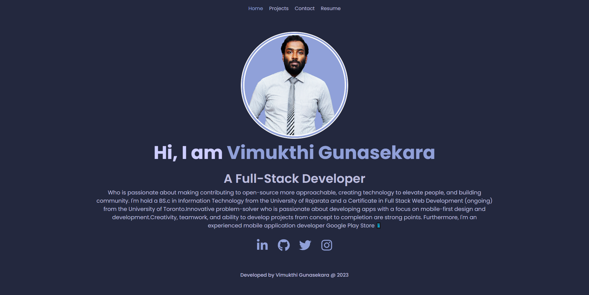

# Reat Portfolio

    
    
    
    
    
    

## Table-of-Contents
* [Links](#Links)
* [Mock-Up](#Mock-Up)
* [License](#License)
* [Contributing](#contributing)
* [FAQs](#faqs)
  
## 🚀 [Links](#table-of-contents)

Deployed URL: 
 
GitHub Repo URL: https://github.com/VimukthiGunasekara/react-portfolio

## 📺 [Mock-Up](#table-of-contents)

         
## 📑 [License](#table-of-contents)

Your repository is licensed under an mit open source license, so other people can contribute more easily.More information can be found by clicking this [link.](https://choosealicense.com/licenses/mit)

## 🤝 [Contributing](#table-of-contents)
We are open to all kinds of contributions. If you want to:
* 🤔 Suggest a feature
* 🐛 Report an issue
* 📖 Improve documentation
* 👨‍💻 Contribute to the code

We are excited that you are reading this and are willing to contribute. No need to think big. Even a typo fix might save our day and make you a hero. Every contribution counts!
     
Feel free to check [issues page](https://github.com/VimukthiGunasekara/react-portfolio/issues) 
     
## 🤔 [FAQs](#table-of-contents)
Please contact me using the following links:

[GitHub](https://github.com/VimukthiGunasekara) / Email: vimukthisadaruwan65@gmail.com
